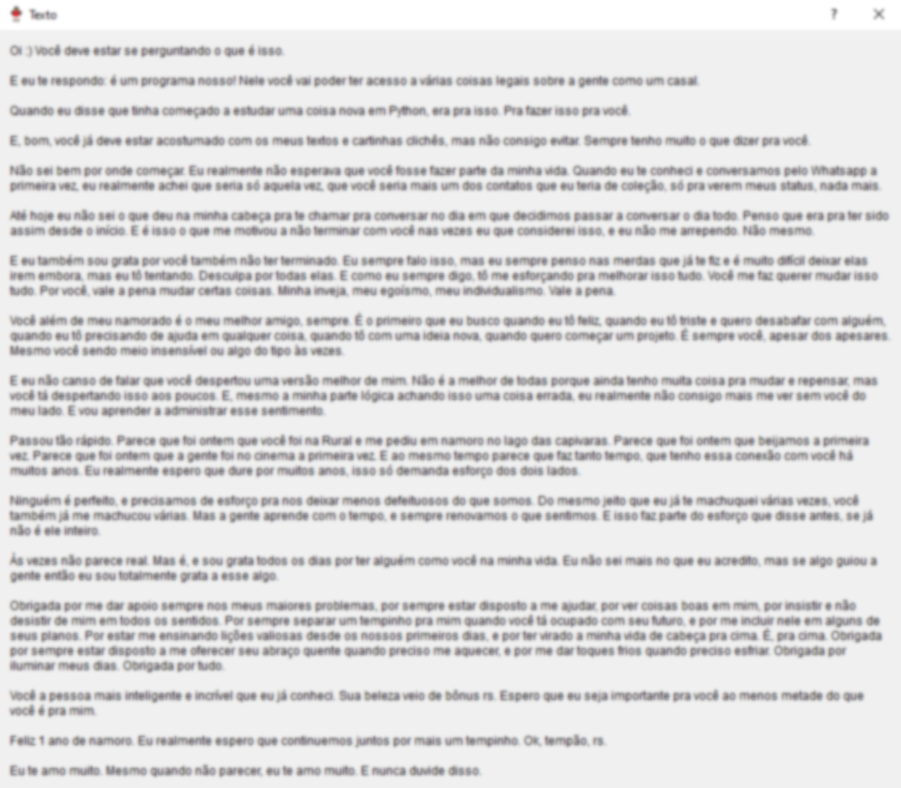

# "Aniversario"
#### _Minha tentativa em PyQt5 de fazer um presente legal de 1 ano de namoro_.

- ### `Login.py` é o primeiro arquivo que deve ser rodado pro programa rodar como deveria!!

  <!-- Versão .exe [aqui](https://github.com/tartaponei/Aniversario-Executavel). -->

  

## Programa em si

#### > Login

- No banco de dados existem 3 opções de login, incluindo uma que foi usada pra testes. Qualquer uma delas vai funcionar. Caso seja a primeira vez entrando (valor `entrada`igual a 0 no banco), então o texto irá aparecer, com um parágrafo por janela.

  - **OBS:** Usuários com coluna `entrada` com valor igual a 1 não vão conseguir ler o texto logo após o login (a não ser que o valor seja alterado no próprio banco com um `UPDATE`). O texto está disponível no menu principal também.

  - **OBS 2:** Só um dos usuários (*sasusaku*) está programado com `entrada` igual a 0 de início

    

------

#### > Principal

- Depois que o login é feito (e o texto é lido caso seja a primeira vez), a tela principal é aberta com 7 opcões de botões: 2 deles abrem links no navegador, e os outros abrem outras janelas.

  - **Playlist (Spotify):**  abre link no navegador; playlist no Spotify.

  - **Álbum (Google Fotos):** abre link no navegador; álbum compartilhado do Google Fotos. Pra evitar muitos usuários com acesso à pasta, temos um print:

    

    

  - **Evolução:** abre uma janela no próprio programa; algumas fotos em ordem cronológica. E um doge pra preencher o espaço que sobrou.

    

    

  - **Texto do Início:** abre uma janela no próprio programa; repetição do texto que aparece na primeira vez que faz o login, inteiro numa única janela (meio borrado pra não dar muito spoiler... rs).

    

    
    
  - **Joguinho:** abre uma janela no próprio programa; uma versão de 2048 feita no próprio Python usando `Tkinter` (código original [aqui](https://github.com/yangshun/2048-python)), adaptado pra conseguir ser acessado pelo programa.
  
    
  
    
  
  - **Créditos:** abre uma janela no próprio programa; créditos e agradecimentos em relação a esse projetinho.
  
    
  
  - **Clica aqui...:** rs.
  
    
  
    

## Observações:

- Essas duas primeiras pastas (`.ideia` e `pycache`) foram geradas automaticamente pelo PyCharm (onde comecei a escrever o programa), mas aí depois migrei pro Sublime Text porque meu humilde PC quase explodiu, e como eu não tinha certeza se podia excluir essas pastas eu deixei elas aí mesmo.

- Na pasta `anotações` tem códigos que usei pra estudar o PyQt5, podem ser úteis.

## Considerações finais

- O programa é extremamente simples mas foi feito com carinho <3.

- Provavelmente uma versão 2.0 sairá algum dia. Aniversário de 2 anos? 3? Ainda em PyQt? Web? Mobile? Ninguém sabe. 

  

## Agradecimentos:

- ##### Jonathan, principalmente.

- ##### Claudia e Bruno

- ##### Carina

- ##### Nayure

  

- Créditos completos no arquivo `textos.txt` ou na tela Créditos.
